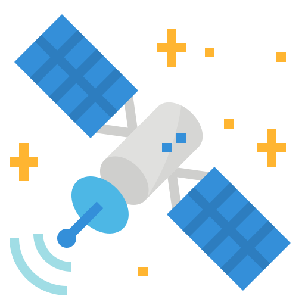

# Voyager 1 

Voyager 1 est l'une des deux sondes spatiales jumelles du programme spatial Voyager de la NASA destinées à l'étude des planètes externes du Système solaire qui n'avaient jusque-là été observées qu'au moyen de télescopes situés sur Terre, notamment les systèmes de Jupiter et de Saturne. Son lancement a eu lieu le 5 septembre 1977.

Icone créée par [monkik](https://www.flaticon.com/authors/monkik) trouvée sur [flaticon](https://www.flaticon.com/).

## Caractéristiques

- Organisation : NASA kg
- Domaine : Étude de Jupiter, Saturne, de leurs lunes et du milieu interstellaire km
- Type de mission : Survols
- Distance :
  - au soleil : 22 265 201 000 km
  - à la terre : 22 212 831 000 km
;